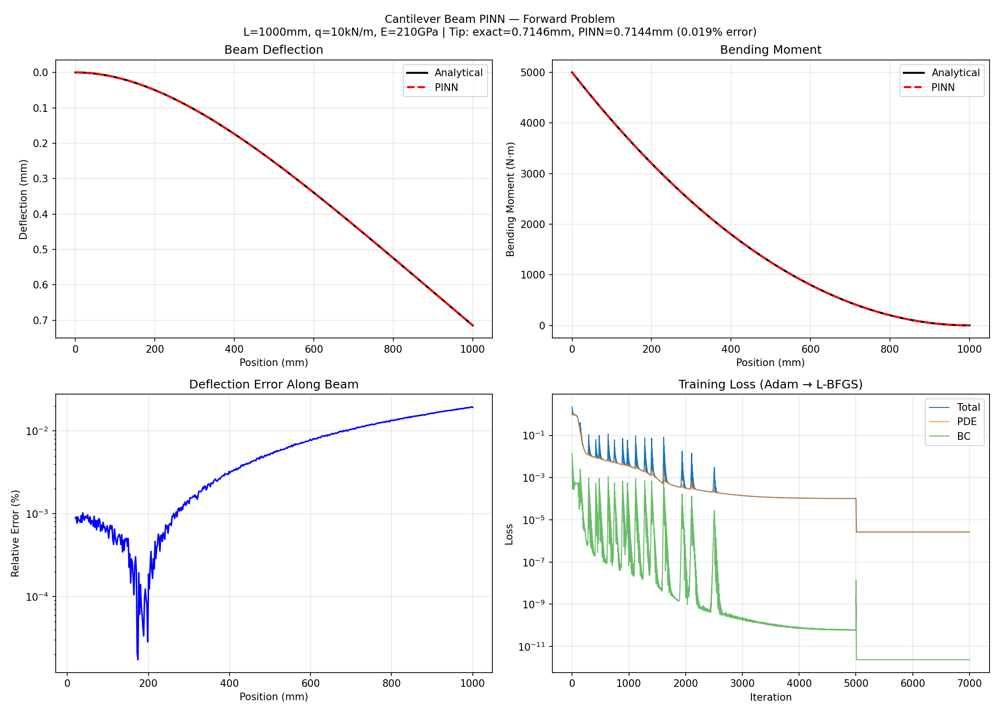
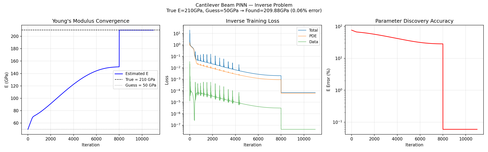

# Cantilever Beam PINN Solver

Physics-informed neural network that solves the Euler-Bernoulli beam equation — without any training data. Learns the solution purely from the PDE and boundary conditions.

Two problems solved:
- **Forward:** Given loads + material properties → predict deflection (0.019% error)
- **Inverse:** Given measured deflections → discover Young's modulus E (0.06% error)

## Results

### Forward Problem (no training data, only physics)

| Metric | Value |
|--------|-------|
| Beam | Steel, L=1000mm, E=210 GPa |
| Load | Uniform 10 kN/m |
| Tip deflection (exact) | 0.7146 mm |
| Tip deflection (PINN) | 0.7144 mm |
| **Tip error** | **0.019%** |
| Mean profile error | 0.007% |

### Inverse Problem (discover material property)

| Metric | Value |
|--------|-------|
| Unknown parameter | Young's modulus E |
| True value | 210 GPa |
| Initial guess | 50 GPa (76% wrong) |
| **Discovered value** | **209.88 GPa (0.06% error)** |
| Measurement points | 10 sensors, 1% Gaussian noise |


*Top: deflection and bending moment (PINN vs analytical). Bottom: error distribution and training loss (Adam → L-BFGS transition visible at epoch 5000).*


*E converges from 50 GPa initial guess to 209.88 GPa (true: 210 GPa). L-BFGS jumps from 151 → 210 GPa in a single step.*

## Critical Insight: Non-Dimensionalization

PINNs fail without proper scaling. The raw Euler-Bernoulli equation mixes quantities spanning 10+ orders of magnitude (E = 210×10⁹, w ~ 7×10⁻⁴). Non-dimensionalizing:

```
x̄ = x/L    w̄ = w·EI/(qL⁴)    →    d⁴w̄/dx̄⁴ = 1
```

All terms become O(1), enabling stable training. This is the #1 lesson for real-world PINNs.

## Training Recipe

1. **Phase 1:** Adam warmup (5,000 epochs, lr=1e-3, cosine annealing)
2. **Phase 2:** L-BFGS refinement (2,000 iterations, strong Wolfe line search)
3. **Architecture:** 4 hidden layers × 64 neurons, Tanh activation (infinitely differentiable for 4th derivatives)
4. **Derivatives:** PyTorch autograd with `create_graph=True` for higher-order

## Project Structure

```
src/
  analytical/beam.py    # Closed-form Euler-Bernoulli solutions (ground truth)
  pinn/model.py         # BeamPINN network + 4th-derivative computation
  pinn/train.py         # Forward and inverse training loops (Adam + L-BFGS)
train.py                # Main training pipeline (forward + inverse)
```

## Quick Start

```bash
pip install -r requirements.txt
python train.py
```

## Tech Stack

- **PyTorch** — PINN model with autograd for 4th-order derivatives
- **L-BFGS** — quasi-Newton optimizer (standard for PINNs)
- **Matplotlib** — solution visualization

## Part of the Physical AI Portfolio

This is Project 3 of a 7-project portfolio proving physics-informed AI skills across thermal systems, energy, structural mechanics, HVAC, pipe networks, rotating machinery, and CFD.
